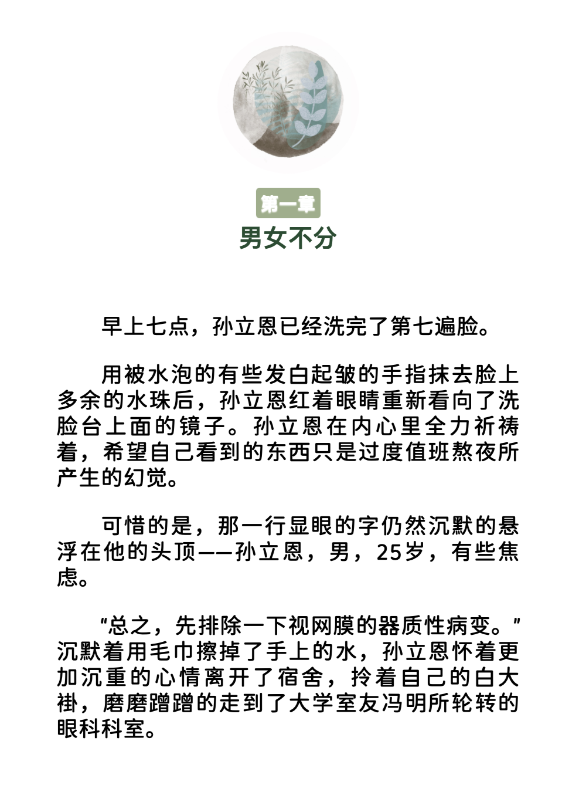
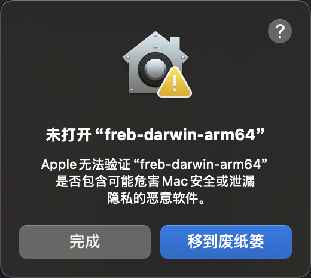
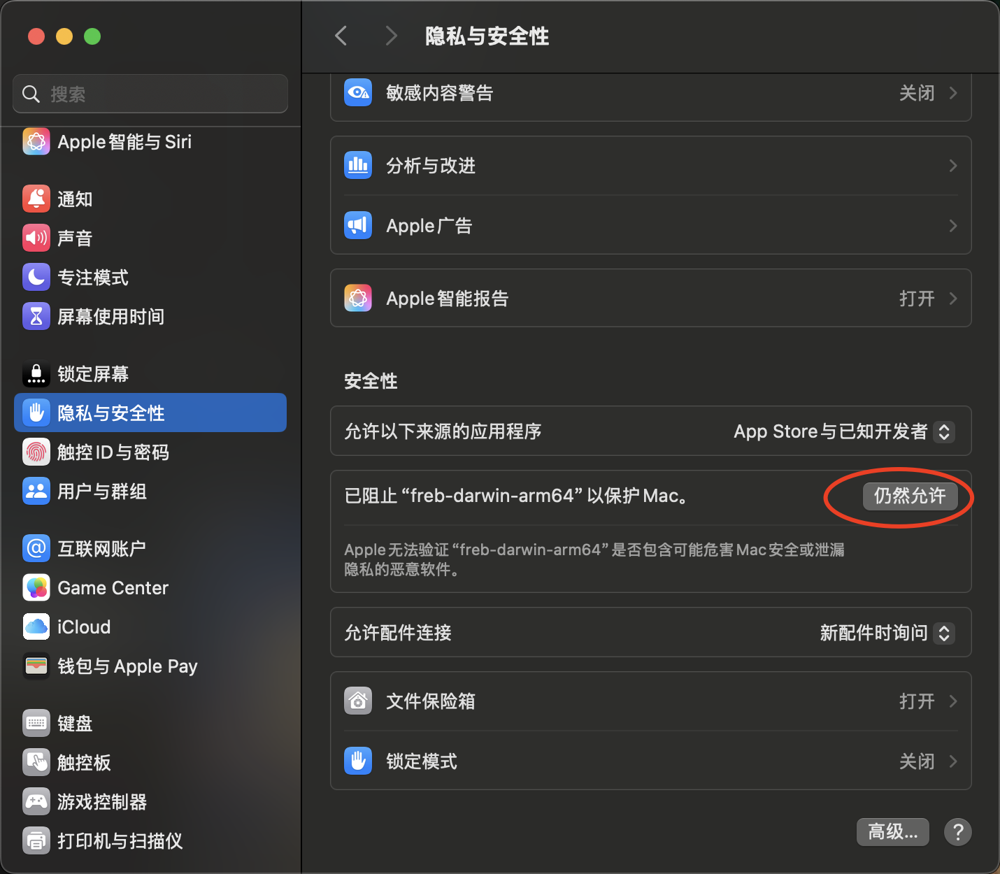

#### 介绍
 - 支持Apple books(ibooks)自定义字体
 - 从 69 书吧下载小说并转化EPub
 - 本地 TXT 转化为 EPub

> 限制爬取频率防止被 ban
> 默认频率(config.toml delay_time)为 每章节/0.8s
> 已测试在域名`69shuba.cx` 下 每章节/0.8s不会被 ban

#### 测试功能

##### 获取第三方目录
> `v0.3.6` 版本支持从其他网站获取目录以保证目录的观赏性,现仅支持:
> \- 起点 - 番茄 - 七猫

> ##### 搜索
> `v0.5.1` 版本支持从 config.toml配置过的的 book_catch对应域名内查找图书

```shell
./freb -g 阵问长生
```

#### 删除特定内容

> 用于删除标题,书籍简介,文章内容中的广告等内容
> 若仍有广告获取要排除的文字,自行添加或者查看本项目的 `config.toml`是否已有更新匹配
> 
> 注意: 
> - 自行配置**正则表达式**,相关语法自行搜索
> - 由于 golang/regexp 库的问题,正则不支持**非捕获组**


```shell
# `-i` 指定爬取的数据介绍页 URL
./freb -u https://69shuba.cx/book/xxxx.htm
# `-u` 指定爬取目录的 URL 
./freb -u https://www.qidian.com/book/1035420986/
# `check --chapter` 用于测试章节是否符合正则和 xpath 规则
./freb check --chapter https://69shuba.cx/book/xxxx.htm
```

#### 预览
<p align="center">
  
  
  
</p>

#### How to use

```shell
Available Commands:
  check       测试 URL 获取书籍时,正则与 xpath 是否匹配
  completion  Generate the autocompletion script for the specified shell
  help        Help about any command
  version     版本

Flags:
  -a, --author string   作者 (default "Unknown")
  -f, --config string   自定义 config.toml 路径(url或本地文件)
  -c, --cover string    封面路径 (default "cover.jpg")
  -u, --curl string     章节爬取url 支持起点,番茄,七猫
  -t, --delay int       每章延迟毫秒数
  -d, --desc            是否包含制作说明,默认包含,使用 -d 来取消包含 (default true)
  -h, --help            help for freb
  -e, --img string      内容介绍logo (default "intro_logo.jpg")
  -j, --jump int        跳过章节数
  -l, --lang string     默认中文zh-Hans,英文 en (default "zh-Hans")
  -o, --out string      输出文件名
  -p, --path string     转化txt路径
  -g, --search string   在已配置域名下搜索书名
  -s, --sub string      每章标题logo (default "content_logo.jpg")
  -i, --url string      下载书籍介绍页(包含图片与简介页面) url
  -b, --vol string      卷logo (default "vol.jpg")

```

##### (一) 爬取小说并转化为 EPub
> 69 书吧地址 
> 1. [69 书吧](69shuba.cx)         书籍 ID 为数字
> 2. [69 阅读](www.69yuedu.net)    书籍 ID 为字母
> 某些小说(书籍 ID 为字母)会从 69 书吧 跳转到 69 阅读

1. 在 [github release界面](https://github.com/chcthink/freb/releases)下载对应系统的可执行文件
2. 在 69书吧搜索界面找到要下载的小说
3. 进入`https://www.69yuedu.net/article/abcdefg.html` 或者`https://69shuba.cx/book/123456.htm` 介绍页,`abcdefg`或`123456`
为该书本 ID
4. 自行定义 config.toml 配置,如 每章下载延时delay_time
5. 在命令行输入以下命令下载小说 (注: **Mac**会出现如下左图片)
6. 在设置中仍然允许(右图片)再重新运行本工具

<p align="center">
  
  
</p>

> 
> 注: **Mac**需要先信任本工具
> 

> 当小说 id 为**数字**时,可以不用 -c 指定封面,工具会自动下载封面(若69书吧存在封面)
``` shell
# ID 为 69 书吧小说的 ID
./freb -i abcdefg ID
```

##### (二) txt 转 EPub

```shell
# -p 指定路径 -a 指定作者 -c 指定封面路径 默认为当前目录下的cover.png
# -o 输出路径
./freb -p xxx.txt -a xxx -c cover.jpg -o xxx.epub
```

#### Tips
 - 由于 69 书吧需要魔法访问,因此本工具也需要魔法
 - 当书籍 ID 为数字且在搜索列表存在封面情况下无法获取封面,尝试重新执行命令
 - 命令每次执行默认会从 github 下载静态文件,包括样式文件和配置文件暂存至本地,若想提高命令速度,可将代码库下的 `config.toml` 和`assets`目录下载至命令同一目录
 - 可以通过修改 `assets`目录和 `config.toml` 文件来自定义 EPub

#### 感谢
 - TXT转化部分参考: [kaf-cli](https://github.com/ystyle/kaf-cli)
 - 排版样式: 阡陌居-笙歌夜夜(~~怎么就不能注册了~~)
 - 图片: [BiancaVanDijk](https://pixabay.com/users/biancavandijk-9606149/)
 - 字体: [975 Maru](https://github.com/lxgw/975maru)
